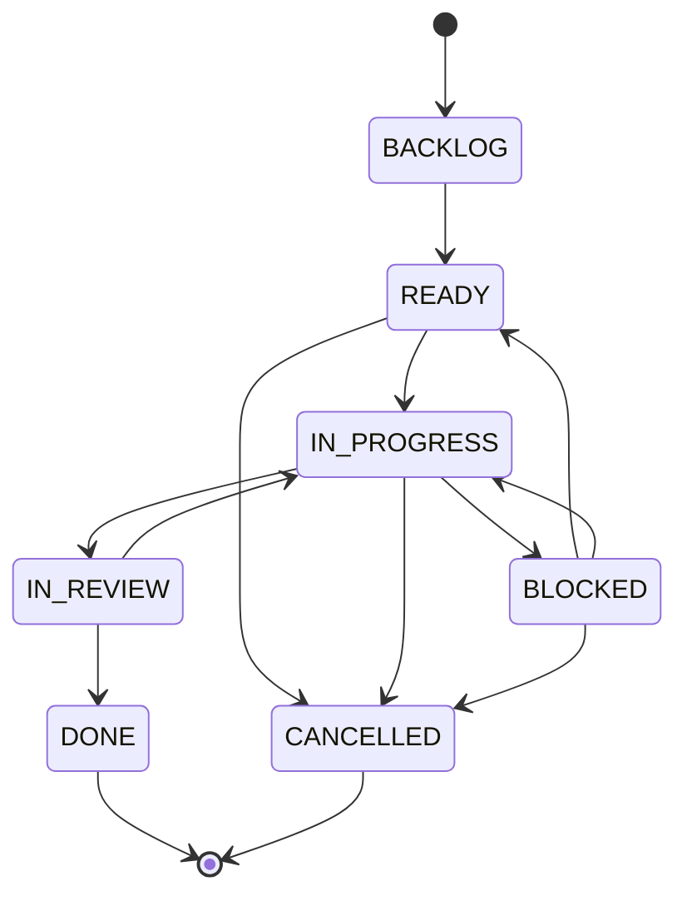
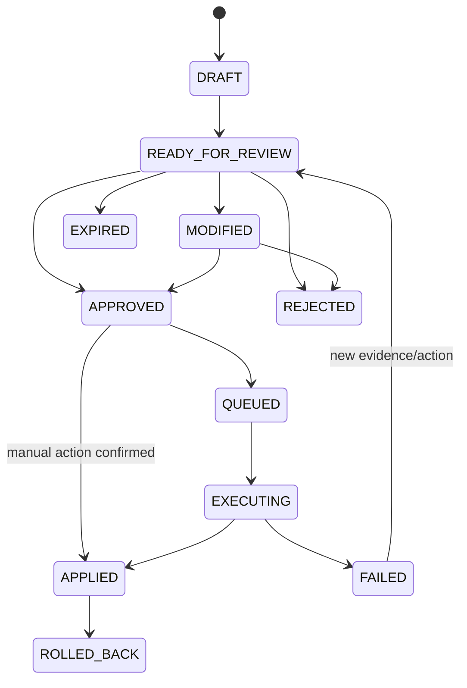
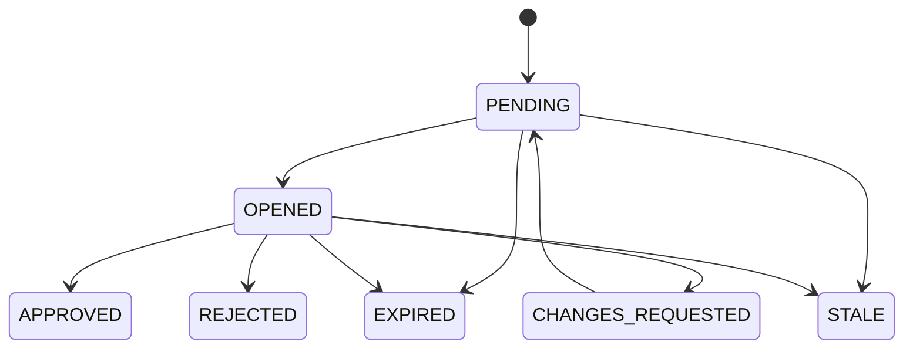
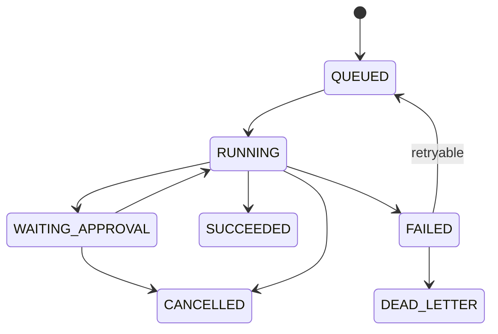
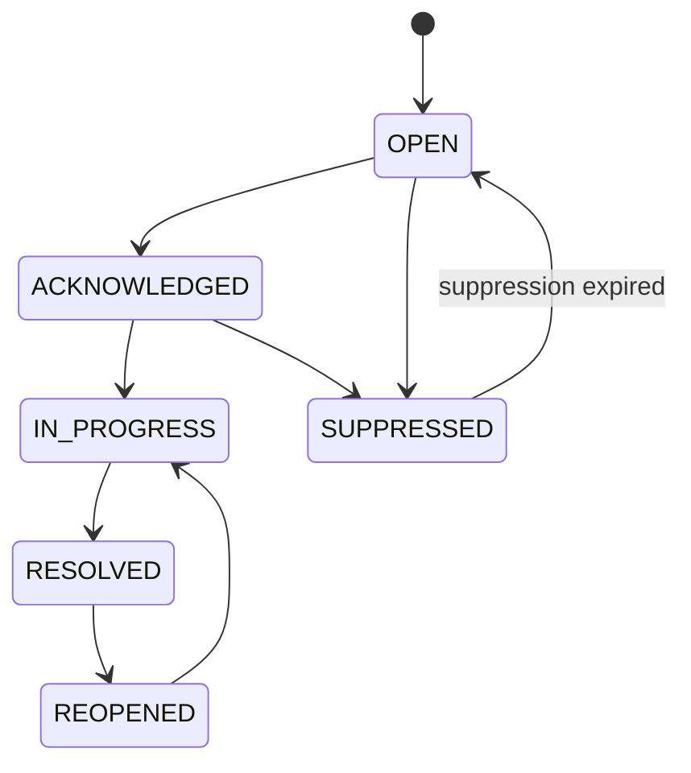

# VENHO OS — MOTHER DASHBOARD
## Technical Plan & Build Spec — v2.0 (Clean Architecture, Agent-Executable)

**Document type:** Implementation Blueprint for an autonomous coding agent
**Status:** Ready to build
**Supersedes:** `VENHO_OS_MOTHER_DASHBOARD_TECHNICAL_SPEC_AND_PLAN_v1.1_OS_v1.3_CONSOLIDATED`
**Design baseline (locked):** `VENHO_OS_HOME_WORKSPACE_UI_SPECIFICATION v1.0`
**Business roadmap:** `VENHO_OS_LIVING_LAB_HUMAN_AI_AGENT_ROADMAP v1.3 QC`
**Primary user:** Solo Founder / Hotel Manager
**Living Lab scope:** Ven Hồ Hotel — 12 rooms
**Default timezone:** `Asia/Bangkok`
**Architecture principles:** Clean Architecture · Workspace-first · Human-in-the-loop · Evidence before automation · System before feature · Dashboard-first, module-ready

---

## 0. HOW TO USE THIS DOCUMENT (READ FIRST — IMPLEMENTING AGENT)

> **You are an AI coding agent (Claude in VS Code) about to build this system.** This document is written so you can go from zero to a working, testable modular monolith without further clarification. Read this section fully before writing any code.

### 0.1 Reading & build order

1. **§1–§3** — understand the mission, the locked architectural decisions (ADRs), and the Clean Architecture layering. Do not deviate from the dependency rule in §3.2.
2. **§4** — internalize the **file tree**. It is the single source of truth for where every artifact lives. Create the scaffold exactly as shown before writing logic.
3. **§5** — apply the cross-cutting conventions (IDs, `Result`, errors, Zod, idempotency, concurrency, money, time) to *every* module.
4. **§6** — build one **bounded context** at a time, following its layer template. Each context section tells you what it owns, its entities, state machines, use cases, ports, adapters, API routes, and tables.
5. **§7–§12** — Home BFF, algorithms, data model, state machines, API, and jobs are the detailed references you pull from while building §6.
6. **§15** — follow the **staged roadmap**. Never skip an Exit Gate. Each stage maps to concrete folders in the file tree.
7. **§16–§18** — write tests as you go, satisfy the Definition of Done, and obey the Handoff Guardrails (the "must never do" list).

### 0.2 Golden rules (violating any of these is a build defect)

- **Dependency rule:** source code dependencies only ever point *inward* — `interface → application → domain`; `infrastructure` implements `application` ports. **Domain imports nothing framework-specific.**
- **The Dashboard is a presentation + command + approval surface.** It never computes business metrics, never normalizes bookings, never builds prompts, never talks to a provider API directly during a page render.
- **A7 owns all metrics.** The frontend and the BFF only *read* precomputed snapshots. If you find yourself writing a KPI formula in React or in the Home BFF, stop — it belongs in the `control-tower` domain.
- **Evidence before automation.** No recommendation may be approved or executed with stale required evidence. No agent may raise its automation level while a hard blocker exists.
- **Approval ≠ execution ≠ publish.** These are always separate transitions and separate buttons. High-risk approvals require the source to be opened first.
- **Every external side effect is idempotent and reconciled**, dispatched via the Transactional Outbox, never inline in a request handler.
- **Policy-as-code.** Business limits (price band, budget envelope, automation level, inventory safety) live in versioned YAML/JSON validated by schema — never hard-coded in UI or scattered in handlers.

### 0.3 Comment convention for generated code

When you generate a file, top it with a short banner so future agents (and the founder) can navigate:

```ts
/**
 * @layer      domain | application | infrastructure | interface
 * @context    execution
 * @owns       Task lifecycle state machine (see PLAN §27, §17)
 * @depends-on nothing (pure)  // or: application ports only, etc.
 * @invariant  A task cannot leave BLOCKED except to READY | IN_PROGRESS | CANCELLED
 */
```

Inside use cases, annotate each guard with the PLAN section it enforces, e.g. `// PLAN §47: execute requires valid approval + non-expired + policy pass + fresh evidence + idempotency key`.

---

## 1. MISSION & SCOPE

The Mother Dashboard is the **operating surface of VENHO OS**: the single place where a solo founder sees what matters today, continues the right work, reviews exceptions, approves decisions, and controls agents — without being buried in metrics.

It consolidates two requirement layers:

1. **Mother Dashboard / Home Workspace** — the primary command surface.
2. **Living Lab Human + AI Agent Roadmap v1.3** — data, agents (A1–A8), KPIs, approvals, phase gates, and hotel operating logic.

> **One-line definition:** *Mother Dashboard = Presentation + Command + Approval surface for all of VENHO OS.* It is not where business logic is computed.

### 1.1 The three layers that must never be merged

| Layer | Responsibility | Must NOT do |
|---|---|---|
| **Mother Dashboard (this build)** | OS-level presentation, command dispatch, approval, navigation, workspace/focus context | Compute metrics, normalize bookings, build content pipelines, call providers at render time |
| **A7 Control Tower** | Metric definitions, snapshots, alerts, business health, Operating Pulse | Own Home layout, generate content |
| **M10 / VENHO AI Studio (M01–M09)** | Presentation + workflow surface for creative/knowledge modules | Become a business-KPI engine |

M10 may be embedded or linked inside the Dashboard. A7 pushes snapshots to the Dashboard. The Dashboard **reads** both; it recomputes neither.

### 1.2 A3 is a workflow, not a new codebase

A3 (Content & Creative) is a persona/workflow running over the existing Studio: `M01 Knowledge → M02 Prompt → M05 Content / M06 Video → M03 Validate → M04 Approval → M07 Publish → M08 Analytics`. M09 is used for cognitive planning. The Dashboard calls a **single Creative adapter capability**, never the individual modules.

---

## 2. ARCHITECTURE DECISION RECORDS (LOCKED)

> **AGENT:** Treat each ADR as a constraint. If a library is unavailable, pick the closest equivalent that preserves the *property* in the rationale, and record a new ADR in `docs/adr/`.

| ADR | Decision | Rationale |
|---|---|---|
| **ADR-001** | **Modular Monolith**, not microservices (year 1) | One deploy, one DB, easy transactions & debugging for a solo founder. Split only on proven need (see §2.1). |
| **ADR-002** | **TypeScript (strict)** end-to-end | One language across domain, BFF, worker, and frontend; shared Zod contracts. |
| **ADR-003** | **Next.js 15 (App Router)** as the single deployable | Server Components + Route Handlers give a natural BFF; RSC keeps provider calls off the render path. |
| **ADR-004** | **PostgreSQL 16** as the system of record | Relational integrity for bookings/approvals/decisions; `TIMESTAMPTZ`, `NUMERIC`, JSONB where needed. |
| **ADR-005** | **Drizzle ORM** for schema + typed queries + SQL migrations | SQL-first and explicit — ideal for an AI agent to read/diff; migrations are versioned files. (Prisma acceptable alternative.) |
| **ADR-006** | **Zod** as the one validation layer | Single schema reused by API validation, domain input guards, fixtures, and manifest validation. |
| **ADR-007** | **pg-boss** (Postgres-backed) for the **Durable Job Queue** | No extra infrastructure; honors "one database". Graphile Worker is an acceptable alternative. |
| **ADR-008** | **Transactional Outbox** relayed by a worker | Guarantees "DB committed ⇒ side-effect job enqueued". No lost jobs, no double-fire. |
| **ADR-009** | **S3-compatible object storage** (R2 / MinIO local) | Raw payloads, artifacts, exports kept out of Postgres; DB stores URIs only. |
| **ADR-010** | **Secrets in a manager/vault**; DB stores references only | Tokens never in payloads, logs, URLs, or activity. |
| **ADR-011** | **Vitest** (unit/integration) + **Playwright** (E2E) | Fast TS-native tests; browser E2E for the critical paths in §94. |
| **ADR-012** | **Single repo, module-boundaried** (`src/modules/*`) with ESLint import-boundary enforcement | Clean Architecture without premature package overhead; promote a module to a package later when evidence justifies. |
| **ADR-013** | **BFF read models are local & precomputed** | Home API p95 < 500ms, zero external calls in the render path (§77). |

### 2.1 When (and only when) to split a module into a service

At least one must be true: a module needs independent scaling; deployment coupling causes real downtime; a hard security boundary is required; external paying customers with a distinct SLA exist; or the team outgrew the monolith. Until then — **stay modular monolith**.

---

## 3. CLEAN ARCHITECTURE MODEL

### 3.1 The four layers (per bounded context)

```
        ┌─────────────────────────────────────────────┐
        │  interface   (Next.js route handlers, RSC,   │  ← framework-aware, thin
        │              server actions, React hooks)    │
        ├─────────────────────────────────────────────┤
        │  application (use cases = commands/queries,  │  ← orchestration, no framework
        │              PORTS = repo/adapter interfaces,│
        │              DTOs, mappers-in)               │
        ├─────────────────────────────────────────────┤
        │  domain      (entities, value objects,       │  ← pure TS, ZERO I/O, ZERO deps
        │              state machines, domain services,│
        │              policy rules, invariants)       │
        └─────────────────────────────────────────────┘
             ▲ infrastructure implements application PORTS
        ┌─────────────────────────────────────────────┐
        │  infrastructure (Drizzle repositories,       │  ← adapters; depends on app + domain
        │                 provider adapters, outbox,   │
        │                 queue, storage, secrets)     │
        └─────────────────────────────────────────────┘
```

### 3.2 Dependency rule (enforced by ESLint boundaries)

- `domain` → **imports nothing** outside itself (and `shared/kernel` pure types).
- `application` → may import `domain` and its own **ports**. Never imports `infrastructure` or `interface`.
- `infrastructure` → may import `application` (to implement ports) and `domain`. Never imported by `domain`/`application`.
- `interface` → may import `application` (use cases) and DTOs. Never reaches into `infrastructure` internals or `domain` entities directly for mutation.
- **Composition root** (`src/composition/`) is the only place that wires concrete infrastructure into application ports (dependency injection).

> **AGENT:** Configure `eslint-plugin-boundaries` (config in §4 tree at `.eslintrc.cjs`) so any violation of §3.2 fails CI. This is your guardrail against "logic leaking into UI".

### 3.3 Bounded contexts (modules)

Each is a folder under `src/modules/<context>/` with the four layers. Ownership is copied verbatim from the original ownership map (§7–§8 of the source) so nothing is lost.

| # | Context (`src/modules/…`) | Owns | Agent / OS mapping |
|---|---|---|---|
| 1 | `identity` | users, workspaces, members, roles, action-authorities, authZ | — |
| 2 | `execution` | projects, objectives, milestones, tasks, task_steps, focus_state, Today's Focus | L4 Execution |
| 3 | `approval-decision` | recommendations, evidence, approval_policies, approval_requests, decision_records, Decision Queue | K4 Decision |
| 4 | `agent-control` | agent_definitions/instances/capabilities/runs/run_steps/dependencies, automation_policies, policy_violations, readiness | K5 Automation, A1–A8 control plane |
| 5 | `hospitality` | properties, room_types, rooms, channels, bookings, source_records, inventory_snapshots, rate_observations, competitors | A1 Guest Intelligence / K3 Memory |
| 6 | `reputation` | guest_reviews, review_topics, root_cause_items | A2 Review & Reputation |
| 7 | `marketing` | campaigns, campaign_daily_metrics, corporate_accounts | A5 Advertising, A8 Corporate Sales |
| 8 | `crm` | guest_profiles, consent_records, crm_journeys, crm_messages | A6 Direct & CRM |
| 9 | `control-tower` | metric_definitions, metric_snapshots, business_alerts, operating_pulse_snapshots | A7 / K6 Business |
| 10 | `roadmap` | roadmap_phases, phase_gates, gate_evaluations, budget_envelopes, budget_change_requests | Roadmap & Gates |
| 11 | `creative` | artifacts, artifact_versions, AI Studio adapter (A3) | A3 / M10 / M01–M09 |
| 12 | `publishing` | publication_items, publishing adapter | M07 Publishing |
| 13 | `activity` | activity_events, notifications | Cross-cutting log |
| 14 | `module-registry` | module_definitions, module_actions, workspace_modules, Quick Actions resolution | Registry |
| 15 | `integration` | integration_connections, provider adapters, sync, jobs, outbox relay | Providers / Durable Jobs |

Two composition modules sit above the contexts:

- `src/bff/home` — the **Home read-model composer** (queries the query-ports of many contexts; owns no domain logic).
- `src/composition` — the **DI wiring / composition root**.

> **AGENT INSTRUCTION — K-Core readiness hard rule (from source §6):** No `agent-control` capability may run a K5 automation while K1–K4 readiness gates are unmet. This is enforced in `agent-control/domain/readiness.ts` and re-checked server-side in the worker (§38, §54).

---

## 4. COMPLETE STANDARDIZED FILE TREE

> **AGENT:** Scaffold this exactly. Every context follows the identical `domain / application / infrastructure / interface` shape so you can code them in parallel with the same mental model. `« … »` marks "repeat the same pattern for every context". Empty leaf folders get a `.gitkeep`.

```text
venho-os/
├── README.md
├── package.json                     # pnpm; scripts: dev, build, worker, test, test:e2e, migrate, seed, lint
├── pnpm-workspace.yaml              # optional; single app now, packages later (ADR-012)
├── tsconfig.json                    # strict; path aliases @domain, @app, @infra, @shared, @modules
├── .eslintrc.cjs                    # eslint-plugin-boundaries enforces §3.2 dependency rule
├── .env.example                     # every env var documented; NO real secrets
├── docker-compose.yml               # postgres:16, minio (S3), mailhog (dev)
├── drizzle.config.ts                # points at src/**/infrastructure/persistence/schema/*.ts
│
├── docs/
│   ├── adr/                         # ADR-001 … ADR-013 (§2) + any new decisions
│   │   └── 0001-modular-monolith.md
│   ├── data-dictionary.md           # generated from schema; every table+column meaning
│   ├── openapi.yaml                 # §45–§53 contract; frozen in Stage 0
│   ├── policies/                    # policy-as-code (§76) — VERSIONED
│   │   ├── approval/*.policy.yaml
│   │   └── automation/*.policy.yaml
│   ├── manifests/
│   │   ├── agents/A1..A8.agent.json # agent_definitions.manifest_json source (§21.1)
│   │   └── modules/*.module.json    # module_definitions source (§14, §10)
│   └── runbooks/                    # backup/restore, on-call, reconciliation
│
├── migrations/                      # Drizzle SQL migrations (generated) — ordered, immutable
│   └── 0000_init.sql
│
├── seed/
│   ├── fixtures/                    # contract-accurate fixtures (Stage 0, frontend-first)
│   │   └── home-snapshot.fixture.ts
│   └── seed.ts                      # seeds workspace, property "Ven Hồ Hotel", 12 rooms, channels
│
├── config/
│   ├── env.ts                       # Zod-validated env loader (fail-fast at boot)
│   ├── timezone.ts                  # Asia/Bangkok default; business-date helpers
│   └── feature-flags.ts             # module/menu enablement via registry
│
├── src/
│   │
│   ├── shared/                      # SHARED KERNEL — pure, dependency-free, imported by anyone
│   │   ├── kernel/
│   │   │   ├── id.ts                # UUID v7 helpers; branded Id<T> types
│   │   │   ├── result.ts            # Result<T,E> / Ok / Err — no throwing across layers
│   │   │   ├── errors.ts            # DomainError base + STABLE error codes (§53)
│   │   │   ├── clock.ts             # Clock port (UTC now) — inject, never call Date.now in domain
│   │   │   ├── money.ts             # Money value object, NUMERIC(14,2) safe, currency-aware
│   │   │   ├── freshness.ts         # Freshness status + per-source thresholds (§42)
│   │   │   └── pagination.ts        # cursor + fixed-limit primitives
│   │   ├── events/
│   │   │   ├── domain-event.ts      # base DomainEvent
│   │   │   └── outbox-event.ts      # outbox envelope contract (§15/§21 source, §8 here)
│   │   ├── auth/
│   │   │   ├── principal.ts         # authenticated actor + roles + action-authorities (§72)
│   │   │   └── authorize.ts         # workspace/property scoping guard (pure policy)
│   │   └── schema/                  # shared Zod primitives reused by every context
│   │       └── common.zod.ts
│   │
│   ├── modules/                     # ── BOUNDED CONTEXTS (§3.3) ──
│   │   │
│   │   ├── identity/
│   │   │   ├── domain/
│   │   │   │   ├── user.ts
│   │   │   │   ├── workspace.ts
│   │   │   │   ├── membership.ts
│   │   │   │   └── role.ts                     # OWNER/EDITOR/VIEWER + approver authorities
│   │   │   ├── application/
│   │   │   │   ├── ports/
│   │   │   │   │   └── identity.repo.ts        # interface (implemented by infra)
│   │   │   │   ├── commands/
│   │   │   │   │   └── invite-member.ts
│   │   │   │   └── queries/
│   │   │   │       └── get-workspace-context.ts
│   │   │   ├── infrastructure/
│   │   │   │   ├── persistence/
│   │   │   │   │   ├── schema/identity.schema.ts   # Drizzle tables
│   │   │   │   │   └── identity.drizzle-repo.ts
│   │   │   │   └── mappers/identity.mapper.ts
│   │   │   └── interface/
│   │   │       └── (route handlers registered in src/app/api — see below)
│   │   │
│   │   ├── execution/              « domain | application | infrastructure | interface »
│   │   │   ├── domain/
│   │   │   │   ├── task.ts                 # entity + version (optimistic lock)
│   │   │   │   ├── task-state-machine.ts   # seven-state, §27 — pure transition table
│   │   │   │   ├── focus.ts                # Today's Focus value object + selectionMode
│   │   │   │   ├── focus-scoring.ts        # focus_score formula (§34.2–§34.3) — PURE
│   │   │   │   ├── project.ts  objective.ts  milestone.ts
│   │   │   │   └── invariants.ts
│   │   │   ├── application/
│   │   │   │   ├── ports/ { task.repo.ts, focus.repo.ts, alert.query-port.ts, gate.query-port.ts }
│   │   │   │   ├── commands/ { transition-task.ts, set-manual-focus.ts, continue-work.ts }
│   │   │   │   └── queries/  { compute-todays-focus.ts, get-current-work.ts }
│   │   │   ├── infrastructure/persistence/ { schema/execution.schema.ts, *.drizzle-repo.ts }
│   │   │   └── interface/ (thin bindings)
│   │   │
│   │   ├── approval-decision/
│   │   │   ├── domain/
│   │   │   │   ├── recommendation.ts
│   │   │   │   ├── recommendation-state-machine.ts     # §28
│   │   │   │   ├── approval-request.ts
│   │   │   │   ├── approval-state-machine.ts           # §29
│   │   │   │   ├── decision-record.ts                  # append-only (§22.5)
│   │   │   │   ├── evidence.ts                         # evidence set/record + freshness (§22.2)
│   │   │   │   ├── decision-queue-ranking.ts           # decision_score (§35) — PURE
│   │   │   │   └── approval-policy.ts                  # policy value object (§22.3)
│   │   │   ├── application/
│   │   │   │   ├── ports/ { recommendation.repo.ts, approval.repo.ts, decision.repo.ts,
│   │   │   │   │            evidence.repo.ts, policy.provider.ts, outbox.port.ts }
│   │   │   │   ├── commands/ { submit-for-review.ts, open-approval.ts, approve.ts,
│   │   │   │   │              modify-and-approve.ts, reject.ts, request-changes.ts,
│   │   │   │   │              execute-recommendation.ts, rollback.ts }
│   │   │   │   └── queries/  { list-decision-queue.ts, get-recommendation.ts }
│   │   │   ├── infrastructure/persistence/ { schema/approval-decision.schema.ts, *.drizzle-repo.ts }
│   │   │   └── interface/
│   │   │
│   │   ├── agent-control/
│   │   │   ├── domain/
│   │   │   │   ├── agent-definition.ts  agent-instance.ts  capability.ts
│   │   │   │   ├── agent-run.ts  agent-run-step.ts
│   │   │   │   ├── agent-run-state-machine.ts          # §30
│   │   │   │   ├── automation-policy.ts                # levels 0–3 (§23)
│   │   │   │   ├── automation-enforcement.ts           # server-side gate (§38) — PURE
│   │   │   │   ├── readiness.ts                        # readiness algo + HARD BLOCKERS (§37)
│   │   │   │   └── dependencies.ts                     # A4→A1+A7, A5→tracking+A7, … (§21.6)
│   │   │   ├── application/
│   │   │   │   ├── ports/ { agent.repo.ts, run.repo.ts, policy.repo.ts, violation.repo.ts,
│   │   │   │   │            kcore-readiness.query-port.ts, queue.port.ts }
│   │   │   │   ├── commands/ { run-capability.ts, pause-agent.ts, resume-agent.ts,
│   │   │   │   │              set-automation-policy.ts, cancel-run.ts, retry-run.ts }
│   │   │   │   └── queries/  { list-agents.ts, get-agent-health.ts, evaluate-readiness.ts }
│   │   │   ├── infrastructure/persistence/ { schema/agent-control.schema.ts, *.drizzle-repo.ts }
│   │   │   └── interface/
│   │   │
│   │   ├── hospitality/            # A1 canonical model (§18)
│   │   │   ├── domain/
│   │   │   │   ├── property.ts room-type.ts room.ts channel.ts
│   │   │   │   ├── booking.ts                          # canonical; version; net_contribution
│   │   │   │   ├── contribution.ts                     # net_contribution formula (§39) — PURE
│   │   │   │   ├── dedupe.ts                           # duplicate detection (§43) — PURE
│   │   │   │   ├── inventory-snapshot.ts rate-observation.ts competitor.ts
│   │   │   │   └── channel-manager-trigger.ts          # §40 — PURE
│   │   │   ├── application/
│   │   │   │   ├── ports/ { booking.repo.ts, inventory.repo.ts, rate.repo.ts,
│   │   │   │   │            source-record.repo.ts, provider.sync-port.ts, storage.port.ts }
│   │   │   │   ├── commands/ { validate-import.ts, commit-import.ts, sync-channel.ts,
│   │   │   │   │              reconcile-booking.ts, merge-candidate.ts }
│   │   │   │   └── queries/  { data-completeness.ts, daily-pickup.ts, list-bookings.ts }
│   │   │   ├── infrastructure/persistence/ { schema/hospitality.schema.ts, *.drizzle-repo.ts }
│   │   │   └── interface/
│   │   │
│   │   ├── reputation/             # A2 (§19)
│   │   │   ├── domain/ { guest-review.ts, review-topic.ts, root-cause.ts,
│   │   │   │            root-cause-aggregation.ts (§44 — PURE), risk-classification.ts }
│   │   │   ├── application/ ports|commands|queries
│   │   │   ├── infrastructure/persistence/ { schema/reputation.schema.ts, *.drizzle-repo.ts }
│   │   │   └── interface/
│   │   │
│   │   ├── marketing/             # A5 ads + A8 corporate (§20.1, §20.2, §20.6)
│   │   │   ├── domain/ { campaign.ts, campaign-metrics.ts, roas.ts (§39 media rule),
│   │   │   │            attribution.ts, corporate-account.ts }
│   │   │   ├── application/ ports|commands|queries
│   │   │   ├── infrastructure/persistence/ { schema/marketing.schema.ts, *.drizzle-repo.ts }
│   │   │   └── interface/
│   │   │
│   │   ├── crm/                   # A6 (§20.3–§20.5)
│   │   │   ├── domain/ { guest-profile.ts, consent.ts, journey.ts, message.ts,
│   │   │   │            suppression.ts }
│   │   │   ├── application/ ports|commands|queries
│   │   │   ├── infrastructure/persistence/ { schema/crm.schema.ts, *.drizzle-repo.ts }
│   │   │   └── interface/
│   │   │
│   │   ├── control-tower/         # A7 — OWNS ALL METRICS (§24, §36)
│   │   │   ├── domain/
│   │   │   │   ├── metric-definition.ts                # formula_version
│   │   │   │   ├── metric-snapshot.ts
│   │   │   │   ├── operating-pulse.ts                  # pulse algorithm (§36) — PURE
│   │   │   │   ├── business-alert.ts
│   │   │   │   └── alert-state-machine.ts              # §31
│   │   │   ├── application/
│   │   │   │   ├── ports/ { metric.repo.ts, snapshot.repo.ts, alert.repo.ts, pulse.repo.ts }
│   │   │   │   ├── commands/ { compute-snapshot.ts, raise-alert.ts, acknowledge.ts,
│   │   │   │   │              resolve.ts, suppress.ts, recompute-pulse.ts }
│   │   │   │   └── queries/  { get-operating-pulse.ts, get-metrics.ts, list-alerts.ts }
│   │   │   ├── infrastructure/persistence/ { schema/control-tower.schema.ts, *.drizzle-repo.ts }
│   │   │   └── interface/
│   │   │
│   │   ├── roadmap/               # phases, gates, budgets (§25, §26, §41)
│   │   │   ├── domain/ { roadmap-phase.ts, phase-gate.ts, gate-evaluation.ts,
│   │   │   │            gate-state-machine.ts (§33), gate-evaluation-engine.ts (§41 — PURE),
│   │   │   │            budget-envelope.ts, budget-change-request.ts }
│   │   │   ├── application/ ports|commands|queries
│   │   │   ├── infrastructure/persistence/ { schema/roadmap.schema.ts, *.drizzle-repo.ts }
│   │   │   └── interface/
│   │   │
│   │   ├── creative/             # A3 / M10 bridge to VENHO AI Studio
│   │   │   ├── domain/ { artifact.ts, artifact-version.ts }
│   │   │   ├── application/
│   │   │   │   ├── ports/ { artifact.repo.ts, ai-studio.port.ts }   # capability interface (§58)
│   │   │   │   ├── commands/ { create-social-package.ts, create-video-script.ts,
│   │   │   │   │              validate-artifact.ts, prepare-publication.ts }
│   │   │   │   └── queries/ { list-artifacts.ts, get-job-status.ts }
│   │   │   ├── infrastructure/
│   │   │   │   ├── adapters/ai-studio.adapter.ts   # maps creative.* → M01–M09 workflow
│   │   │   │   └── persistence/ { schema/creative.schema.ts, artifact.drizzle-repo.ts }
│   │   │   └── interface/
│   │   │
│   │   ├── publishing/           # M07 — external side effect, SEPARATE from approval (§32)
│   │   │   ├── domain/ { publication-item.ts, publication-state-machine.ts (§32) }
│   │   │   ├── application/ ports { publication.repo.ts, publisher.port.ts, outbox.port.ts }
│   │   │   │                commands { submit-for-approval, schedule, publish, mark-published }
│   │   │   ├── infrastructure/ { adapters/*.publisher.ts, persistence/publishing.schema.ts }
│   │   │   └── interface/
│   │   │
│   │   ├── activity/             # activity_events + notifications (sanitized, no PII)
│   │   │   ├── domain/ { activity-event.ts, notification.ts, sanitizer.ts }
│   │   │   ├── application/ ports|commands|queries
│   │   │   ├── infrastructure/persistence/ { schema/activity.schema.ts, *.drizzle-repo.ts }
│   │   │   └── interface/
│   │   │
│   │   ├── module-registry/      # module_definitions/actions, workspace_modules, Quick Actions
│   │   │   ├── domain/ { module-definition.ts, module-action.ts, quick-action-resolver.ts }
│   │   │   ├── application/ ports|commands|queries { resolve-quick-actions.ts }
│   │   │   ├── infrastructure/persistence/ { schema/module-registry.schema.ts, *.drizzle-repo.ts }
│   │   │   └── interface/
│   │   │
│   │   └── integration/          # providers, sync, jobs, outbox relay (§54–§57)
│   │       ├── domain/ { retry-classification.ts (§55 — PURE), sync-checkpoint.ts }
│   │       ├── application/
│   │       │   ├── ports/ { provider-adapter.port.ts (§56), job-queue.port.ts,
│   │       │   │            outbox.repo.ts, secret.port.ts }
│   │       │   └── commands/ { dispatch-outbox.ts, run-job.ts, reconcile.ts }
│   │       └── infrastructure/
│   │           ├── queue/pgboss.queue.ts
│   │           ├── outbox/outbox.relay.ts          # commit → enqueue guarantee (§15/§8)
│   │           ├── providers/                      # one adapter per provider, ALL implement port
│   │           │   ├── pms.adapter.ts   agoda.adapter.ts   booking.adapter.ts
│   │           │   ├── google-hotel.adapter.ts   meta.adapter.ts   make.adapter.ts
│   │           │   └── manual-fallback.adapter.ts  # CSV import/export path (§57)
│   │           ├── secrets/secret-store.ts
│   │           └── persistence/ { schema/integration.schema.ts, jobs.drizzle-repo.ts }
│   │
│   ├── bff/
│   │   └── home/
│   │       ├── home-snapshot.query.ts     # composes read models from many contexts' query-ports
│   │       ├── home-snapshot.dto.ts        # exact §46 response contract (Zod)
│   │       ├── source-mapping.ts           # §11 widget→source-of-truth→adapter table, in code
│   │       └── partial-error.ts            # per-section freshness + partialErrors envelope
│   │
│   ├── composition/                        # COMPOSITION ROOT (only place infra meets app)
│   │   ├── container.ts                     # wires concrete repos/adapters into ports (DI)
│   │   ├── use-cases.ts                     # exported, ready-to-call use case instances
│   │   └── worker-container.ts              # DI for the worker process
│   │
│   ├── app/                                 # Next.js App Router (INTERFACE layer only)
│   │   ├── layout.tsx  globals.css
│   │   ├── (dashboard)/
│   │   │   ├── page.tsx                      # MotherDashboardPage (RSC, calls bff/home)
│   │   │   ├── projects/  tasks/  knowledge/  workbench/
│   │   │   ├── creative-studio/  agents/  operations/
│   │   │   ├── publishing/  reports/  settings/
│   │   │   └── loading.tsx  error.tsx  empty-states/
│   │   └── api/
│   │       └── v1/                           # Route Handlers = thin controllers → use cases
│   │           ├── workspaces/[id]/home/route.ts        # §46
│   │           ├── recommendations/…/route.ts           # §47
│   │           ├── approvals/…/route.ts                 # §48
│   │           ├── agents/  agent-instances/  agent-runs/…   # §49
│   │           ├── properties/[id]/{operating-pulse,metrics,alerts}/route.ts  # §50
│   │           ├── integrations|imports/…/route.ts       # §51
│   │           └── roadmap|phase-gates/…/route.ts        # §52
│   │
│   ├── components/                          # PRESENTATION (dumb, prop-driven, no business logic)
│   │   ├── layout/ { WorkspaceHeader.tsx, SidebarNavigation.tsx }
│   │   ├── home/
│   │   │   ├── TodaysFocusCard.tsx  CurrentWorkCard.tsx
│   │   │   ├── OperatingPulseStrip.tsx  DecisionReviewCard.tsx
│   │   │   ├── PublicationApprovalCard.tsx  QuickActionsGrid.tsx
│   │   │   ├── AgentWorkflowHealthCard.tsx  RecentActivityTimeline.tsx
│   │   │   └── states/ { Loading, Empty, Stale, PartialError, NoPermission }.tsx
│   │   └── ui/                              # design-system primitives (a11y §65)
│   │
│   └── styles/  hooks/  lib/                # client utilities; NO domain logic
│
├── worker/
│   └── index.ts                            # long-running process: outbox relay + pg-boss jobs (§54)
│
└── tests/
    ├── unit/                               # mirrors src/modules/**/domain (§92) — pure, fast
    ├── integration/                        # DB + outbox + isolation (§93)
    ├── e2e/                                # Playwright — E2E-01..07 (§94)
    ├── failure-injection/                  # §95
    └── fixtures/                           # shared, contract-accurate
```

### 4.1 Why this shape (UX/DX rationale)

- **One folder pattern, fifteen times.** Every context is `domain/application/infrastructure/interface`. An agent that has built one context can build the next with near-zero context switching — this is the biggest DX win for automated coding.
- **Pure domain is trivially testable.** Every algorithm from Part VII of the source (focus, decision queue, pulse, readiness, contribution net, dedupe, gate eval) lives in a `*.ts` file with no I/O, so `tests/unit` mirrors it 1:1.
- **The dependency rule is mechanically enforced** (ESLint boundaries), so "business logic leaking into UI" — Risk #1 in the source — becomes a failing lint, not a code-review hope.
- **The BFF is a *composer*, not a brain.** `src/bff/home` can only import query-ports, so it structurally cannot compute a metric.
- **Providers are swappable.** Every provider implements one `ProviderAdapter` port (§56); the manual CSV path is just another adapter, so "no fake automation" (§57) is a first-class citizen.

---

## 5. CROSS-CUTTING CONVENTIONS (APPLY TO EVERY MODULE)

> **AGENT:** These are non-negotiable and identical across all contexts. Implement them once in `src/shared/kernel` and reuse.

**5.1 Identifiers.** Public IDs are UUID (v7 preferred for index locality). Use branded types `Id<'Booking'>` to prevent mixing ID kinds. External provider IDs are **never** internal primary keys (source §16.12) — they live in `*_source_records`.

**5.2 Result, not throw, across layers.** Domain and application return `Result<T, DomainError>`. Only the interface layer translates `Err` → HTTP status + stable error code. This keeps guards explicit and testable.

**5.3 Stable error codes.** Central enum in `shared/kernel/errors.ts`. Includes the standard set (§53): `EVIDENCE_STALE`, `APPROVAL_REQUIRED`, `APPROVAL_EXPIRED`, `POLICY_LIMIT_EXCEEDED`, `AUTOMATION_LEVEL_NOT_ALLOWED`, `AGENT_DEPENDENCY_NOT_READY`, `INVENTORY_SAFETY_BLOCK`, `BUDGET_ENVELOPE_EXCEEDED`, `CONSENT_REQUIRED`, `PHASE_GATE_BLOCKED`, `SOURCE_DATA_INCOMPLETE`, `PROVIDER_RECONCILIATION_REQUIRED`.

**5.4 One validation layer (Zod).** Each context defines Zod schemas colocated with its DTOs. The *same* schema validates the API request, the use-case input, and the fixtures. Never re-validate ad hoc.

**5.5 Optimistic concurrency.** Every mutable business row has `version INTEGER`. Commands take `expectedVersion` (API: `If-Match`). Mismatch → `409 VERSION_CONFLICT`.

**5.6 Idempotency for side effects.** Every external side effect requires an `Idempotency-Key`; the worker checks it before executing (§54). Duplicate key = return the prior result, never re-fire.

**5.7 Time & business date.** Store `TIMESTAMPTZ` in UTC. Compute business date from the property timezone (`config/timezone.ts`). Never derive a business date in the browser.

**5.8 Money.** `Money` value object over `NUMERIC(14,2)` + currency. No floats for money, ever. Default currency `VND`.

**5.9 Freshness is per-source (§42).** Do not collapse into a single `lastSyncAt`. Each read model carries its own `freshnessStatus` (`FRESH | STALE | UNKNOWN`) and observed timestamp.

**5.10 Authorization on every query.** Workspace-scoped always; property-scoped when applicable; action-authorities (§72) for approvals. The guard lives in `shared/auth/authorize.ts` and is called at the start of every use case.

---

## 6. BOUNDED CONTEXT SPECIFICATIONS

> **AGENT:** Build in the order of §15 (roadmap), not the order below. Each spec lists **Owns / Never owns / Entities / State machines / Key use cases / Ports / API / Tables**. Detailed column definitions are in the Data Model appendix (§9); state machines in §10; algorithms in §8; API in §11.

### 6.1 `identity`
- **Owns:** users, workspaces, workspace_members, roles + action-authorities, authorization scoping.
- **Never owns:** any business data.
- **Entities:** `User`, `Workspace`, `Membership`, `Role`.
- **Key use cases:** `getWorkspaceContext` (feeds Home header), `inviteMember`.
- **Ports:** `IdentityRepo`.
- **Tables:** `users`, `workspaces`, `workspace_members`.

### 6.2 `execution` (L4)
- **Owns:** projects, objectives, milestones, tasks, task_steps, workspace_focus_state, **Today's Focus** and **Current Work**.
- **Never owns:** metric calculation, booking data.
- **Entities:** `Project`, `Objective`, `Milestone`, `Task` (+`version`), `TaskStep`, `Focus`.
- **State machines:** Task seven-state (§27, §10). Transitions live in `task-state-machine.ts` as a pure table; the use case only calls `canTransition(from,to)` then persists with `expectedVersion`.
- **Key use cases:** `transitionTask`, `setManualFocus`, `continueWork`, `computeTodaysFocus` (query — reads L4 tasks + A7 alert query-port + roadmap gate query-port), `getCurrentWork` (exactly one active task).
- **Algorithms:** Today's Focus priority + `focus_score` (§8.1 / source §34) — **pure**. `AUTO_SUGGESTED` focus is persisted only after the user clicks Continue/Select.
- **Ports:** `TaskRepo`, `FocusRepo`, and **inbound query-ports** it depends on: `AlertQueryPort` (from control-tower), `GateQueryPort` (from roadmap). It imports interfaces, not the other contexts' code.
- **API:** tasks/focus/current-work endpoints (§11).
- **Tables:** `projects`, `objectives`, `milestones`, `tasks`, `task_steps`, `workspace_focus_state`.

### 6.3 `approval-decision` (K4)
- **Owns:** recommendations, evidence_sets/records, approval_policies, approval_requests, decision_records, the **Unified Decision Queue**.
- **Never owns:** how a recommendation is generated (agents do that), how it is published (publishing does that).
- **Entities:** `Recommendation` (+`version`), `ApprovalRequest`, `DecisionRecord` (append-only), `EvidenceSet`/`EvidenceRecord`, `ApprovalPolicy`.
- **State machines:** Recommendation (§28), Approval (§29) — §10.
- **Key use cases:** `submitForReview`, `openApproval`, `approve`, `modifyAndApprove` (stores human-edited action, recomputes impact), `reject`, `requestChanges`, `executeRecommendation`, `rollback`, `listDecisionQueue`.
- **Guards (enforced in use cases, cite the PLAN section in code):**
  - `execute` requires: valid approval **and** non-expired recommendation **and** policy pass **and** fresh required evidence **and** idempotency key (§47).
  - Approval expires when the recommendation expires or its source version changes (§28).
  - High-risk approval must be `OPENED` before a decision (§29, §61).
  - `decision_records` are immutable; a correction creates a *new* linked record (§22.5).
- **Algorithms:** `decision_score` + hard ordering (§8.2 / source §35) — pure.
- **Ports:** `RecommendationRepo`, `ApprovalRepo`, `DecisionRepo`, `EvidenceRepo`, `ApprovalPolicyProvider` (reads versioned YAML), `OutboxPort`.
- **API:** §47, §48.
- **Tables:** `recommendations`, `evidence_sets`, `evidence_records`, `approval_policies`, `approval_requests`, `decision_records`.

### 6.4 `agent-control` (K5, A1–A8 control plane)
- **Owns:** agent_definitions/instances/capabilities/runs/run_steps/dependencies, automation_policies, policy_violations, **readiness** & **automation-level enforcement**.
- **Never owns:** the domain logic of each agent's subject area (that lives in hospitality/reputation/marketing/crm/control-tower/creative). This context is the *control plane*, not the workers.
- **Entities:** `AgentDefinition`, `AgentInstance`, `Capability`, `AgentRun`, `AgentRunStep`, `AutomationPolicy`.
- **State machines:** Agent Run (§30).
- **Key use cases:** `runCapability`, `pauseAgent`, `resumeAgent`, `setAutomationPolicy`, `cancelRun`, `retryRun`, `evaluateReadiness`, `getAgentHealth`.
- **Guards:**
  - `runCapability` and any automation must pass **server-side automation enforcement** (§8.4 / source §38): load instance → active policy → validate level, scope, price/budget/inventory bounds, data freshness, approval/decision → only then enqueue.
  - **Hard blockers** (§8.5 / source §37.2) prevent raising automation level: data completeness below threshold, no approval policy, non-idempotent external action, no rollback/manual fallback, workflow not stable 4 weeks, undefined evidence freshness, security/consent not passed.
  - K5 automation blocked unless K1–K4 readiness gates pass (source §6).
  - Dependency readiness (§21.6): A4→A1+A7, A5→tracking+A7, A3→AI Studio, A6→consent, A8→founder-hours-saved gate. Unmet ⇒ `AGENT_DEPENDENCY_NOT_READY`.
- **Ports:** `AgentRepo`, `RunRepo`, `AutomationPolicyRepo`, `ViolationRepo`, `KCoreReadinessQueryPort`, `JobQueuePort`.
- **API:** §49.
- **Tables:** `agent_definitions`, `agent_instances`, `agent_capabilities`, `agent_runs`, `agent_run_steps`, `agent_dependencies`, `automation_policies`, `policy_violations`.

### 6.5 `hospitality` (A1 / K3)
- **Owns:** the **canonical booking model** and all hotel primitives — properties, room_types, rooms, channels, bookings, booking_source_records, inventory_snapshots, rate_observations, competitor_* .
- **Never owns:** Home UI, pricing *decision* (that is A4 recommendation via approval-decision), metric formulas.
- **Entities:** `Property`, `RoomType`, `Room`, `Channel`, `Booking` (+`version`, `net_contribution`), `BookingSourceRecord`, `InventorySnapshot`, `RateObservation`, `Competitor*`.
- **Key use cases:** `validateImport` → `commitImport` (**always two-step**, §51), `syncChannel`, `reconcileBooking`, `mergeCandidate`, `dataCompleteness`, `dailyPickup`.
- **Algorithms (pure):** `net_contribution` (§8.6 / source §39), duplicate detection exact-then-probabilistic-for-review-only (§8.7 / source §43), channel-manager trigger (§8.8 / source §40).
- **Guards:** external ID change ⇒ no overwrite, open reconciliation; negative inventory ⇒ `INVENTORY_SAFETY_BLOCK`, never auto-publish; partial channel sync ⇒ per-channel state, not global success; merges are audited & reversible.
- **Ports:** `BookingRepo`, `InventoryRepo`, `RateRepo`, `SourceRecordRepo`, `ProviderSyncPort`, `StoragePort`.
- **API:** §51.
- **Tables:** §18.1–§18.9.

### 6.6 `reputation` (A2)
- **Owns:** guest_reviews, review_topics, root_cause_items.
- **Never owns:** compensation promises (human-only approval via approval-decision).
- **Key use cases:** review ingestion, classification/topic tagging, `aggregateRootCause` (pure, §44), draft response (→ approval if sensitive).
- **Guards:** sensitive excerpts never stored in event logs (§19.2); compensation-required ⇒ human-only.
- **Tables:** `guest_reviews`, `review_topics`, `root_cause_items`.

### 6.7 `marketing` (A5 + A8)
- **Owns:** campaigns, campaign_daily_metrics, corporate_accounts.
- **Never owns:** auto-launch or budget-override (A5 must stay within envelope), signing (A8 needs human confirmation).
- **Algorithms:** ROAS on **net_contribution / media_spend**, never gross (§39). ±10% ad adjustment allowed only after Gate Phase 2.
- **Guards:** budget over envelope ⇒ `BUDGET_ENVELOPE_EXCEEDED` + block; A8 cannot record a signed agreement without human confirmation.
- **Tables:** `campaigns`, `campaign_daily_metrics`, `corporate_accounts`.

### 6.8 `crm` (A6)
- **Owns:** guest_profiles (minimal PII), consent_records, crm_journeys (PRE_ARRIVAL / IN_STAY / POST_STAY), crm_messages.
- **Never owns:** complaint/refund exceptions (escalate to human).
- **Guards:** every message carries template version, consent decision, approval policy, delivery status, idempotency key, guest-exception flag. Withdrawn consent ⇒ stop future CRM, keep minimal audit ⇒ `CONSENT_REQUIRED` blocks otherwise. Open complaint ⇒ suppress promotional messages.
- **Tables:** `guest_profiles`, `consent_records`, `crm_journeys`, `crm_messages`.

### 6.9 `control-tower` (A7 / K6) — **the only metric owner**
- **Owns:** metric_definitions (with `formula_version`), metric_snapshots, business_alerts, operating_pulse_snapshots.
- **Never owns:** Home layout, content generation.
- **Entities & SM:** `MetricDefinition`, `MetricSnapshot`, `BusinessAlert` + Alert state machine (§31).
- **Algorithms:** Operating Pulse per domain → one status of `HEALTHY|WATCH|ACTION_REQUIRED|UNKNOWN` (§8.3 / source §36). Revenue, inventory safety, reputation, agent/data health.
- **Key use cases:** `computeSnapshot`, `recomputePulse` (writes `operating_pulse_snapshots` read model), `raiseAlert`, `acknowledge`, `resolve`, `suppress`, `getOperatingPulse`.
- **Contract:** metric detail endpoints must return `formula_version` (§50). The Dashboard only **reads** `operating_pulse_snapshots`.
- **Tables:** §24.1–§24.4.

### 6.10 `roadmap`
- **Owns:** roadmap_phases (0–4), phase_gates, gate_evaluations, budget_envelopes, budget_change_requests.
- **Entities & SM:** Phase Gate state machine (§33).
- **Algorithms:** Gate evaluation engine (§8.9 / source §41) — runs on schedule, on source-metric change, near deadline, or on human request. Hard-gate fail ⇒ block dependent capability + alert + Today's Focus candidate; waiver only via an L2-compatible Decision Record.
- **Example hard gates:** data completeness ≥95%; serious inventory mismatch = 0; tracking pass 14 days; founder hours saved ≥25% before corporate outreach; workflow running ≥4 weeks before "go live".
- **Tables:** `roadmap_phases`, `phase_gates`, `gate_evaluations`, `budget_envelopes`, `budget_change_requests`.

### 6.11 `creative` (A3 / M10 bridge)
- **Owns:** artifacts, artifact_versions, and the **AI Studio adapter** exposing coarse capabilities.
- **Never owns:** a second content pipeline. It calls the Studio; it does not reimplement M01–M09.
- **Capabilities (the only surface Home uses, §58):** `creative.create_social_package`, `creative.create_video_script`, `creative.validate_artifact`, `creative.prepare_publication`. The adapter maps each to the `M01→…→M08` workflow.
- **Ports:** `ArtifactRepo`, `AiStudioPort`.
- **Tables:** `artifacts`, `artifact_versions`.

### 6.12 `publishing` (M07)
- **Owns:** publication_items and the publish side effect.
- **Golden rule:** **approval and publish are separate** (§32). The Approve button on Home never publishes. Duplicate publish click ⇒ exactly one external post (idempotency).
- **State machine:** Publication (§32).
- **Ports:** `PublicationRepo`, `PublisherPort`, `OutboxPort`.
- **Tables:** `publication_items`.

### 6.13 `activity`
- **Owns:** activity_events (max 10 sanitized on Home), notifications.
- **Guards:** no PII, no sensitive review excerpts in the log.
- **Tables:** `activity_events`, `notifications`.

### 6.14 `module-registry`
- **Owns:** module_definitions, module_actions, workspace_modules, **Quick Actions resolution** (max 6, registry-driven — never hard-coded, §10 source).
- **Key use case:** `resolveQuickActions(workspace)` → merges `module_actions` + `agent_capabilities`.
- **Tables:** `module_definitions`, `module_actions`, `workspace_modules`.

### 6.15 `integration`
- **Owns:** integration_connections, jobs, sync_checkpoints, the **Outbox relay**, and all **provider adapters**.
- **Contracts:** `ProviderAdapter` port (§56) — every provider (PMS, Agoda, Booking, Google, Meta, Make, and the manual-CSV fallback) implements the same interface. Retry classification is a pure function (§55).
- **Worker loop:** the 13-step job execution sequence (§12 / source §54) lives in `application/commands/run-job.ts` and is invoked by `worker/index.ts`.
- **Tables:** `integration_connections`, `jobs`, `sync_checkpoints`, `outbox_events`.

---

## 7. HOME BFF — READ-MODEL COMPOSITION

The Home page is a single `GET /api/v1/workspaces/{id}/home` composed by `src/bff/home/home-snapshot.query.ts`. It **only** calls query-ports; it holds no domain logic and makes **no external provider call** (§77).

### 7.1 Layout order (locked UX, source §10.1)

```text
Header → Today's Focus → Current Work → Operating Pulse / Critical Exceptions
→ Needs Decision & Review + Ready to Publish → Quick Actions + Agent/Workflow Health
→ Recent Activity
```

### 7.2 Widget → source-of-truth → adapter (implement as `source-mapping.ts`)

| Widget | Source of truth (owning context) | Query-port used | Home cap |
|---|---|---|---|
| Today's Focus | execution + control-tower alerts + roadmap gates | `computeTodaysFocus` | 1 |
| Current Work | execution | `getCurrentWork` | exactly 1 |
| Operating Pulse | control-tower `operating_pulse_snapshots` | `getOperatingPulse` | ≤ 4 |
| Needs Decision & Review | approval-decision | `listDecisionQueue` | ≤ 5 |
| Ready to Publish | publishing | `listReadyToPublish` | — |
| Quick Actions | module-registry | `resolveQuickActions` | ≤ 6 |
| Agent Health | agent-control | `getAgentHealth` | ≤ 4 |
| Recent Activity | activity | `listRecentActivity` | ≤ 10 |

### 7.3 Resilience contract (every widget)

Each section resolves independently and returns one of: `loading | empty | stale | partial_error | permission | ok`. A failing section degrades to an Advisory — **it never crashes the page**. The response envelope carries `meta.partialErrors[]` and `meta.sectionFreshness{}` (source §46). This is the structural answer to source Risk #2 (module failure) and the "Advisory not crash" principle.

---

## 8. CORE ALGORITHMS (PURE DOMAIN SERVICES)

> **AGENT:** Each lives in the `domain/` folder of its context as a pure function with the signature shown, and gets a 1:1 unit test in `tests/unit`. **No machine learning in year 1** (source §34.2).

### 8.1 Today's Focus (`execution/domain/focus-scoring.ts`)
Priority order before scoring: (1) valid manual focus in business date → (2) current `IN_PROGRESS` task continuable → (3) critical actionable safety alert → (4) hard phase gate due/failing → (5) approved recommendation needing manual execution → (6) normal task by score → (7) empty. A critical alert qualifies only if it has a human owner, an action route, is not duplicate/suppressed, and evidence is still fresh.

```text
focus_score = priority_score*0.25 + due_urgency_score*0.20 + continuity_score*0.20
            + milestone_gate_score*0.15 + business_impact_score*0.10 + effort_fit_score*0.10
```
Business impact bands: safety/guest-commitment 100; revenue-blocking 90; data-reliability blocker 85; revenue-optimization 70; production/marketing 55; housekeeping 50–90 by severity; documentation-only 30.

### 8.2 Unified Decision Queue (`approval-decision/domain/decision-queue-ranking.ts`)
Hard ordering first: (1) inventory safety → (2) guest commitment/legal/compensation → (3) budget overspend → (4) price/promotion expiry → (5) publication schedule → (6) normal content review. Within a tier:
```text
decision_score = safety_score*0.30 + deadline_score*0.20 + financial_impact*0.20
               + guest_brand_impact*0.15 + evidence_freshness*0.10 + waiting_age*0.05
```
Home shows ≤5; full queue is filterable.

### 8.3 Operating Pulse (`control-tower/domain/operating-pulse.ts`) — **A7 computes, Dashboard reads**
Each domain → one of `HEALTHY|WATCH|ACTION_REQUIRED|UNKNOWN` with one reason + one action.
- **Revenue health:** occupancy, ADR, RevPAR, pickup, direct share, contribution net → show only the top exception.
- **Inventory safety → ACTION_REQUIRED** when: serious mismatch, near-overbooking, sync stale past threshold, manual-sync trigger over limit, or required connection expired.
- **Reputation:** review SLA, high-risk review, repeated root cause, rating trend.
- **Agent/data:** A1 completeness, agent run health, workflow failure, evidence freshness, job dead-letter.

### 8.4 Automation Level Enforcement (`agent-control/domain/automation-enforcement.ts`) — **server is the final gate**
```text
requested_action → load agent instance → load active automation policy → validate level
→ validate action scope → validate price/budget/inventory bounds → validate data freshness
→ validate approval/decision → enqueue job
```
Frontend button-disable is UX only; the backend enforces. Any breach ⇒ block server-side, write `policy_violations`, raise alert, do **not** enqueue the external job (source §23.2).

### 8.5 Agent Readiness (`agent-control/domain/readiness.ts`)
Score components: K1 knowledge, K2 workflow, K3 data completeness/quality, K4 decision-policy coverage, test coverage, approval policy configured, observed run reliability, human owner. **Hard blockers override the score** (see §6.4). Result shape:
```json
{ "status": "NOT_READY | READ_ONLY_READY | RECOMMENDATION_READY | LIMITED_AUTOMATION_READY",
  "score": 0, "hardBlockers": [], "evidence": [] }
```

### 8.6 Contribution Net (`hospitality/domain/contribution.ts`)
```text
net_contribution = gross_room_revenue − discount_amount − commission_amount
                 − media_fee_allocated − payment_fee − variable_fulfillment_cost
                 − compensation_or_refund
```
Budget/ROAS decisions must use `net_contribution / media_spend`, never gross booking revenue.

### 8.7 Duplicate Booking Detection (`hospitality/domain/dedupe.ts`)
Exact match first: `property + channel + external_booking_id`. Probabilistic fallback (check-in/out, guest-contact hash, room type, gross amount, booked-timestamp proximity) produces **review candidates only — never auto-merge**. Merges are audited and reversible.

### 8.8 Channel-Manager Trigger (`hospitality/domain/channel-manager-trigger.ts`)
Emit `ACTION_REQUIRED` when any of: multi-channel bookings >15/week; manual inventory edits >3/day; near/actual overbooking; founder/front-office >3h/week on sync; required direct integration lacks two-way sync. The trigger creates a task/decision — it never buys or switches a vendor.

### 8.9 Gate Evaluation (`roadmap/domain/gate-evaluation-engine.ts`)
Runs on schedule / source-metric change / near deadline / human request. Hard-gate fail ⇒ block dependent capability, raise alert, create a Today's Focus candidate, allow waiver only via an L2-compatible Decision Record. Gate metric unavailable ⇒ `UNKNOWN`, never `PASS`.

### 8.10 Data Freshness (`shared/kernel/freshness.ts`)
Per-source thresholds (do not collapse): inventory minutes–hours; booking pickup days; ads spend 24h; reviews 24–48h; competitor rates by stay-date window; monthly metrics after closing.

---

## 9. DATA MODEL APPENDIX (CANONICAL)

> **AGENT:** These are the authoritative tables. Generate one Drizzle schema file per context under `…/infrastructure/persistence/schema/`. Apply the DB principles below to **every** table.

### 9.1 Database principles (source §16)
PostgreSQL = system of record · UUID public IDs · `TIMESTAMPTZ` in UTC · business date by property timezone · every business table has `workspace_id` (hotel tables also `property_id`) · core fields are real columns, JSONB only for validated extension metadata · optimistic `version` · soft-delete/archive where recovery matters · PII separated from analytics · external IDs are never internal PKs · every recommendation carries evidence + source freshness · every external side effect is idempotent.

### 9.2 Foundation tables (kept from v1.0, all required)
`users`, `workspaces`, `workspace_members`, `projects`, `objectives`, `milestones`, `tasks`, `task_steps`, `workspace_focus_state`, `artifacts`, `artifact_versions`, `review_items`, `publication_items`, `activity_events`, `notifications`, `module_definitions`, `module_actions`, `workspace_modules`, `integration_connections`, `jobs`, `sync_checkpoints`, plus `outbox_events`.

Task lifecycle (seven-state): `BACKLOG, READY, IN_PROGRESS, BLOCKED, IN_REVIEW, DONE, CANCELLED`.

### 9.3 Hospitality canonical model (context `hospitality`)

**`properties`** — id(PK), workspace_id, name, timezone(IANA), currency CHAR(3) default VND, room_count(>0), status(ACTIVE|PAUSED|ARCHIVED), created_at, updated_at.

**`room_types`** — id(PK), property_id, code(unique/property), name, capacity SMALLINT(>0), view_type(nullable), is_active, metadata_json(JSONB validated).

**`rooms`** — id(PK), property_id, room_type_id, room_number(unique/property), status(ACTIVE|OUT_OF_ORDER|ARCHIVED).

**`channels`** — id(PK), workspace_id, channel_key(DIRECT|AGODA|BOOKING|GOOGLE_HOTEL|PHONE|ZALO), display_name, channel_type(DIRECT|OTA|META|OFFLINE), is_core_year1, status. Unique `(workspace_id, channel_key)`.

**`bookings`** (canonical, A1-owned) — id(PK), workspace_id, property_id, channel_id, external_booking_id(nullable), booking_status(PENDING|CONFIRMED|CHECKED_IN|CHECKED_OUT|CANCELLED|NO_SHOW), booked_at, check_in_date, check_out_date(> check_in), room_nights(validated), room_type_id, room_id(nullable), guest_profile_id(nullable), currency, gross_room_revenue, discount_amount, commission_amount, payment_fee, media_fee_allocated, net_contribution(calculated), lead_time_days(calculated), is_repeat_guest(nullable), source_updated_at, ingested_at, data_quality_status(VALID|WARNING|INVALID), version. Unique when external present: `(property_id, channel_id, external_booking_id)`.

**`booking_source_records`** — id(PK), booking_id, provider_key, external_id, source_hash, raw_storage_uri(encrypted/restricted; object storage), observed_at. (Raw provider payload never rendered on Home.)

**`inventory_snapshots`** — id(PK), property_id, room_type_id, channel_id, stay_date, available_rooms(≥0), restriction_json(JSONB), observed_at, freshness_status(FRESH|STALE|UNKNOWN). Index `(property_id, stay_date, room_type_id, channel_id)`.

**`rate_observations`** — id(PK), property_id, channel_id, room_type_id, stay_date, rate_plan_key(BAR|NON_REF|MOBILE…), gross_rate, estimated_net_rate, currency, observed_at.

**`competitor_properties`** / **`competitor_rate_observations`** — competitor identity, segment match, distance/area, review score, room/view comparability, stay date, rate, cancellation terms, observed time, source. Stale-past-threshold competitor prices must not feed automated recommendations.

### 9.4 Reputation (context `reputation`, source §19)
**`guest_reviews`** — id, property_id, channel_id, external_review_id(nullable), rating NUMERIC(4,2)(nullable), review_text(nullable), review_language(nullable), reviewed_at, risk_level(NORMAL|COMPLAINT|HIGH_RISK|COMPENSATION_REQUIRED), response_status(NONE|DRAFTED|APPROVAL_REQUIRED|APPROVED|POSTED), source_updated_at.
**`review_topics`** — review_id, topic_key(cleanliness|noise|mattress|bathroom|staff|view|location|value), sentiment(POSITIVE|NEUTRAL|NEGATIVE), confidence, evidence_excerpt_hash, model_version.
**`root_cause_items`** — topic, recurrence_count, severity, first/last_observed, human_owner, corrective_task, status, verified_resolved_date.

### 9.5 Marketing & Corporate (context `marketing`, source §20.1–§20.2, §20.6)
**`campaigns`** — provider, campaign_external_id, campaign_type(G1..G4|MT1..MT3), approved_budget_envelope, status, launch_approval_id, tracking_readiness, start/end_date.
**`campaign_daily_metrics`** — spend, impressions, clicks, sessions, conversions, gross_revenue, net_contribution, CTR/CPC/CVR/CPA/ROAS, attribution_model, data_freshness, source_timestamp.
**`corporate_accounts`** — account_name, priority_rank(1–10), segment, contact_refs, opportunity_stage, proposed_rate, approved_rate, est_room_nights, follow_up_date, human_owner, negotiation_status. A8 cannot write a signed agreement without human confirmation.

### 9.6 CRM (context `crm`, source §20.3–§20.5)
**`guest_profiles`** — internal_id, name/masked_name, encrypted contact refs, language, consent_status, repeat_status, last_stay, suppression_flags (minimal PII only).
**`consent_records`** — guest_profile, purpose, channel, status(GRANTED|WITHDRAWN|UNKNOWN), source, granted/withdrawn_time, evidence_reference.
**`crm_journeys`** (PRE_ARRIVAL|IN_STAY|POST_STAY) / **`crm_messages`** — template_version, consent_decision, approval_policy, delivery_status, idempotency_key, guest_exception_flag.

### 9.7 Agent Control Plane (context `agent-control`, source §21)
**`agent_definitions`** — agent_key(PK, A1..A8), name, purpose, owner_module_key, build_order, max_automation_level_year1(0–3), status(ACTIVE|PAUSED|DEPRECATED), manifest_version, manifest_json(schema-validated).
**`agent_instances`** — workspace/property, agent_key, version, status(SETUP_REQUIRED|READ_ONLY|ACTIVE|DEGRADED|PAUSED), automation_level, last_successful_run, health, config_reference, policy_set_id.
**`agent_capabilities`** — capability_key, agent_key, action_type, required_input_schema, output_schema, required_approval_policy, execution_mode, risk_class, required_kcore_readiness.
**`agent_runs`** — agent_instance, capability, trigger_type, status, input_snapshot_hash, evidence_set, recommendation/outputs, model/provider_version, cost, started/finished, correlation_id, failure_classification.
**`agent_run_steps`** — sequence, step_type, tool/module, input/output_hash, status, approval_wait_state, retry_count.
**`agent_dependencies`** — e.g. A4→A1+A7, A5→tracking+A7, A3→AI Studio, A6→consent, A8→founder-hours-saved gate.

### 9.8 Recommendation / Approval / Decision (context `approval-decision`, source §22)
**`recommendations`** — id, workspace_id, property_id(nullable), agent_key, recommendation_type(PRICE|PROMOTION|INVENTORY|BUDGET|RESPONSE|CRM|CORPORATE_RATE), title, summary, proposed_action_json, expected_impact_json, risk_json, valid_from(nullable), expires_at, status(state machine), evidence_set_id, source_freshness_status(FRESH|STALE|MIXED), version, created_at.
**`evidence_sets`** / **`evidence_records`** — source_type, source_entity_id, source_version/hash, observed_time, freshness_threshold, confidence, summary, provenance_uri, human_verified. **Cannot approve when required evidence is stale.**
**`approval_policies`** (config-first) — action_type, risk_class, required_role, source_must_be_opened, dual_confirmation_required, allowed_automation_level, max_price_delta, max_budget_delta, inventory_conditions, expiry, rollback_requirement.
**`approval_requests`** — source_type/version, policy_id/version, risk_level, status, assigned_approver, due_time, viewed_token/time, decision_note, expiry, approval_result. Unique per source/version/policy cycle.
**`decision_records`** (append-only) — decision_type, approved/rejected/modified, human_actor, recommendation_version, policy_version, evidence_set, reason, effective_period, rollback_condition, created_time. Never edited; corrections link a new record.

### 9.9 Automation Policy (context `agent-control`, source §23)
**`automation_policies`** — agent/capability, level(0=read-only,1=recommend+approve-each,2=auto-apply-in-band,3=broad), price_floor/ceiling, max_change_percent, allowed dates/room_types/channels, budget_envelope, required_data_freshness, suspension_triggers, effective_from/to, approved_decision_record.
**`policy_violations`** — every over-policy attempt blocked server-side, recorded, alerted, and never enqueued.

### 9.10 Control Tower (context `control-tower`, source §24)
**`metric_definitions`** — metric_key, name, formula_version, unit, grain(daily|weekly|monthly), source_dependencies, freshness_requirement, threshold_rules, owner=A7.
**`metric_snapshots`** — property, metric_key, period, value, numerator/denominator, formula_version, data_completeness, freshness, calculated_at, evidence_set.
**`business_alerts`** — alert_type, severity, status, metric/recommendation/source, detected_at, action_deadline, assigned_owner, suppression_key, resolution.
**`operating_pulse_snapshots`** (Home read model) — revenue/inventory/reputation/agent-data health, status/reason/action, generated_at, expires_at. Dashboard reads this only.

### 9.11 Roadmap & Budget (context `roadmap`, source §25–§26)
**`roadmap_phases`** — phase_code(0–4), start/end, objective, status, sequence.
**`phase_gates`** — gate_key, phase, metric/condition, operator, threshold, hard/soft, required_evidence, owner.
**`gate_evaluations`** — gate_version, evaluation_time, result(PASS|FAIL|WAIVED|UNKNOWN), evidence, human_waiver_decision, notes.
**`budget_envelopes`** — category, approved_amount, spent, committed, remaining, period, decision_record, status.
**`budget_change_requests`** — any increase beyond envelope requires approval.

---

## 10. STATE MACHINE APPENDIX

> **AGENT:** Encode each as a pure transition table in the owning context's `domain/*-state-machine.ts`; the use case calls `canTransition()` then persists with `expectedVersion`. Illegal transitions return an `Err`, never throw.

**Task (execution §27)**


**Recommendation (approval-decision §28)**

Rules: `APPROVED` ≠ applied; approval voids on expiry or source-version change; `MODIFIED` stores the human-edited action; `APPLIED` needs external/manual confirmation; rollback links the original decision.

**Approval (approval-decision §29)**

High-risk approval must reach `OPENED` before any decision.

**Agent Run (agent-control §30)**


**Alert (control-tower §31)**


**Publication (publishing §32)** — approval and publish always separate:
```text
DRAFT → READY_FOR_APPROVAL → APPROVED → SCHEDULED/QUEUED → PUBLISHING → PUBLISHED/FAILED
```

**Phase Gate (roadmap §33)**
```text
NOT_EVALUATED → EVALUATING → PASS | FAIL | UNKNOWN
FAIL → WAIVED (only with Decision Record)
PASS → REOPENED (if evidence invalidated)
```

---

## 11. API APPENDIX

**11.1 Rules (source §45).** Prefix `/api/v1`; JSON-schema (Zod) validation; correlation ID on every request/job; `Idempotency-Key` for side effects; `If-Match`/`expectedVersion` for mutations; stable error codes; workspace/property authorization; never return raw provider payloads or unnecessary PII. Route Handlers are thin controllers that validate → call a use case → map `Result` to HTTP.

**11.2 Home** — `GET /api/v1/workspaces/{workspaceId}/home?propertyId&projectId&date` → the §7 snapshot (contract in `home-snapshot.dto.ts`). Response includes `todayFocus`, `currentWork`, `operatingPulse[]`, `needsDecisionReview[]`, `readyToPublish[]`, `quickActions[]`, `agentHealth[]`, `recentActivity[]`, `header`, `phase`, and `meta{generatedAt, partialErrors[], sectionFreshness{}}`.

**11.3 Recommendations (§47)** — `GET /workspaces/{id}/recommendations`, `GET /recommendations/{id}`, `POST …/submit-review`, `…/approve`, `…/modify-and-approve`, `…/reject`, `…/execute`, `…/rollback`. `execute` requires valid approval + non-expired + policy pass + fresh evidence + idempotency key.

**11.4 Approvals (§48)** — `GET /workspaces/{id}/approvals`, `POST /approvals/{id}/open|approve|reject|request-changes`. High-risk source requires a viewed token.

**11.5 Agents (§49)** — `GET /workspaces/{id}/agents`, `GET /agent-instances/{id}`, `POST /agent-instances/{id}/run|pause|resume`, `PUT /agent-instances/{id}/automation-policy`, `GET /agent-runs/{id}`, `POST /agent-runs/{id}/cancel|retry`. Frontend never calls a provider directly.

**11.6 Control Tower (§50)** — `GET /properties/{id}/operating-pulse|metrics|alerts`, `POST /alerts/{id}/acknowledge|resolve|suppress`. Metric detail must return `formula_version`.

**11.7 Hospitality Ingestion (§51)** — `POST /integrations/{id}/sync`, `POST /imports/bookings/validate`, `POST /imports/bookings/commit`, `GET /imports/{id}`; provider webhooks via allowlist + signature verification. Import is always validate/preview → commit.

**11.8 Phase Gates (§52)** — `GET /roadmap/phases`, `GET /phase-gates`, `POST /phase-gates/{id}/evaluate|waive|reopen`. Waive requires a Decision Record.

**11.9 Error codes (§53)** — see §5.3.

---

## 12. BACKGROUND JOBS & INTEGRATION

**12.1 Worker job loop** (`integration/application/commands/run-job.ts`, run by `worker/index.ts`). Every job: (1) claim atomically → (2) check idempotency → (3) load immutable capability/policy version → (4) load secret reference → (5) validate input → (6) check evidence freshness → (7) check approval → (8) check automation policy → (9) execute provider/module call → (10) reconcile uncertain result → (11) update domain state → (12) write activity + outbox event → (13) release lock.

**12.2 Transactional Outbox** (`integration/infrastructure/outbox/outbox.relay.ts`). A command that changes DB *and* needs a side effect: commit domain change + write `outbox_events` in the **same transaction**; the relay reads outbox, dispatches the job/integration, marks dispatched. Guarantees no "DB success but job never enqueued".

**12.3 Retry classification** (`integration/domain/retry-classification.ts`, pure). Retryable: timeout, rate limit, transient 5xx, lock contention, brief network blip. Permanent-until-human: invalid payload, permission/scope, expired/disconnected account, policy rejection, unsupported media, consent absent, stale approval, safety block.

**12.4 Provider abstraction** (`integration/application/ports/provider-adapter.port.ts`). Every provider implements:
```ts
interface ProviderAdapter {
  validateConnection(): Promise<HealthResult>;
  fetchChanges(cursor?: string): Promise<SyncBatch>;
  execute(command: ProviderCommand, idempotencyKey: string): Promise<ProviderResult>;
  reconcile(reference: ReconcileReference): Promise<ReconcileResult>;
}
```

**12.5 Manual fallback** (`manual-fallback.adapter.ts`). When an API is missing/unstable: CSV import/export, human confirmation, manual execution record, evidence attachment — **no fake automation**.

**12.6 AI Studio adapter** (`creative/infrastructure/adapters/ai-studio.adapter.ts`). Home calls coarse capabilities (`creative.create_social_package`, `creative.create_video_script`, `creative.validate_artifact`, `creative.prepare_publication`); the adapter maps them onto the `M01→M02→M05/M06→M03→M04→M07→M08` workflow. Home never calls a Studio module directly.

---

## 13. FRONTEND SPECIFICATION

**13.1 Component tree** (`src/components`, all prop-driven, zero business logic):
```text
MotherDashboardPage
├── WorkspaceHeader
├── SidebarNavigation
├── TodaysFocusCard
├── CurrentWorkCard
├── OperatingPulseStrip
├── DecisionReviewCard
├── PublicationApprovalCard
├── QuickActionsGrid
├── AgentWorkflowHealthCard
└── RecentActivityTimeline
```

**13.2 Sidebar (source §9):** Home Workspace · Projects · Tasks · Knowledge · Workbench · Creative Studio · Agents · Operations · Publishing · Reports · Settings. `Agents` = control/status/config (not a chat room). `Operations` = OTA/booking/review/CRM/front-office. `Reports` = A7 snapshots + history (no frontend metric math). Hide non-enabled menus via the module registry.

**13.3 Visual hierarchy:** Today's Focus → Current Work → critical exception/decision → publish approval → Quick Action → health/activity. **No large charts on Home.**

**13.4 Decision Review Card:** each row shows type icon, title, agent/source, risk/severity, expiry/deadline, evidence freshness, primary action. High-risk items have **no one-click approve** until the detail is opened.

**13.5 Operating Pulse UI:** ≤4 items, no wall of numbers, click → A7 detail, `UNKNOWN` visibly distinct from `HEALTHY`, stale data shows a timestamp.

**13.6 Agent Health UI:** agent, status, last successful run, blocker, repair/configure/open action. Automation level is **not** changeable from Home.

**13.7 Responsive.** Desktop: Focus + Current Work on top, Pulse beneath, Decision ∥ Publish, Quick Actions ∥ Agent Health. Mobile order: Focus → Current Work → Critical Pulse → Decision Queue → Publish → Quick Actions → Agent Health → Activity.

**13.8 Accessibility (§65):** full keyboard, status never color-only, visible focus, touch target ≥44px, screen-reader announcements for job/approval, reduced-motion, confirmation for irreversible actions.

---

## 14. EDGE CASES (BUILD AS EXPLICIT TESTS)

> **AGENT:** Each row below becomes a named test in `tests/integration` or `tests/failure-injection`. Full matrices in source Part XI (§66–§71). Highlights:

- **Booking/inventory:** same booking from PMS+OTA → link source records, canonical dedupe; external ID change → no overwrite, reconcile; negative inventory → safety block, no auto-publish; partial channel sync → per-channel state, not global success; stale inventory but Home still opens → Pulse `ACTION_REQUIRED`, local execution still works.
- **Pricing/promotion:** recommendation expires before approval → `EXPIRED`; competitor data stale → no auto-apply, lower confidence; price below floor → server blocks; promotion stack → negative net rate blocked with risk explanation; provider accepted but response timeout → reconcile before retry.
- **Review/guest:** compensation → human-only; legally risky AI draft → policy validator + escalation; consent withdrawn → stop future CRM, keep minimal audit; open complaint → suppress promo.
- **Ads:** tracking broken but spend continues → critical alert + block scale; budget over envelope → block automated adjustment; ±10% before Phase 3 gate → policy violation.
- **Agent/AI:** malformed output → schema fail; hallucinated source → evidence must resolve to a source record; prompt injection in upload → treat as untrusted + tool allowlist; agent runs 4 weeks but output unused → not counted as "live".
- **Phase/roadmap:** gate metric unavailable → `UNKNOWN`, not `PASS`; human waive hard gate → Decision Record required; founder-hours-saved gate fail → corporate outreach blocked.

---

## 15. SECURITY, PRIVACY & GOVERNANCE

**15.1 Authorization (§72):** workspace-scoped every query; property-scoped when needed; roles OWNER/EDITOR/VIEWER plus action authorities PRICE_APPROVER, INVENTORY_APPROVER, BUDGET_APPROVER, PUBLISH_APPROVER, GUEST_COMMITMENT_APPROVER. A solo founder may hold all, **but the policy must still exist**.

**15.2 PII (§73):** minimize; encrypt contact identifiers; never in activity logs; mask in UI where unnecessary; retention policy; purpose-specific consent; export/delete workflow.

**15.3 Secrets (§74):** secret manager / encrypted vault; DB stores references only; tokens never in job payloads, logs, URLs, or activity.

**15.4 Audit (§75):** mandatory for price/promotion approval, inventory change, budget change, external publish, guest message, compensation/refund, automation-level change, phase-gate waiver, agent-policy change.

**15.5 Policy-as-code (§76):** approval/automation policies are versioned YAML/JSON validated by schema in `docs/policies/`. No business limits hard-coded or scattered in UI.

---

## 16. PERFORMANCE & OBSERVABILITY

**16.1 Targets (§77):** Home local-data API p95 <500ms; **no external provider call in the Home request path**; first usable content <2.5s; command feedback <200ms pending state; every query has a fixed limit + index; Operating Pulse is a precomputed read model.

**16.2 Metrics (§78):** API latency/errors, DB query latency, Home partial errors, data-freshness breaches, job-queue latency, agent success/failure/cost, recommendation approval rate, applied-impact, policy violations, provider reconciliation count, dead-letter count, founder-hours-saved measurement completeness.

**16.3 Health model (§79):** separate application / database / integration / agent / data-freshness / business-safety health. Never a single green dot hiding a failure.

---

## 17. IMPLEMENTATION ROADMAP (STAGED — DO NOT SKIP EXIT GATES)

> **AGENT:** Build in this dependency order. Each stage lists which file-tree folders you create/populate and its Exit Gate. Agent build order (A1→A2/A7→A3→A4→A5→A8→A6) is deliberate for revenue; A8 precedes A6.

```text
Contracts → Database Core → Execution/Approval Services → Home BFF → Frontend Shell
→ Hospitality Canonical Data → A1 → A2 + A7 → A3 Studio Integration → A4 → A5 → A8 → A6 → Productization
```

**Stage 0 — Freeze contracts.** ✅ COMPLETE (2026-07-13) — `shared/kernel/{result,freshness}.ts` · error codes frozen · `home-snapshot.dto.ts` Zod-ready contract · `focus-scoring.ts` pure algorithm · 25 unit tests pass (vitest). Remaining: `docs/adr`, `docs/openapi.yaml`, `docs/policies`, `docs/manifests`, `seed/fixtures`. **Exit gate:** no DB code while any status meaning is ambiguous. ✅ Met.

**Stage 1 — Mother Dashboard Core.** ✅ SCAFFOLD COMPLETE (2026-07-13) — `bff/home/{dto,query}.ts` · `modules/execution/domain/focus-scoring.ts` · `modules/module-registry/application/queries/resolve-quick-actions.ts` · `app/os/page.tsx` (RSC) · `components/os/{HomeWorkspace,SidebarNavigation,WorkspaceHeader}.tsx` · `app/api/v1/workspaces/[id]/home/route.ts` (+ Stage 0 auth guard) · OTA-01 surfaced in AgentHealth + OperatingPulse + Activity. Architecture bugs fixed: dependency inversion in module-registry, sidebar missing Agents+Operations, AgentHealth card missing from UI. Remaining: full DB + identity + activity + outbox (Stage 1 DB pass). **Exit gate:** Dashboard runs on seeded/local data with no external provider dependency. ✅ Met (mock data, no external call).

**Stage 2 — Agent/Decision Control Plane.** agent-control + approval-decision: definitions/instances/capabilities/runs, recommendations/evidence, approval policies/requests, decision records, automation policies, alerts. Decision Review + Agent Health cards; detail pages; automation level read-only. **Exit gate:** create a mock recommendation, approve, and execute via a mock adapter with full audit.

**Stage 3 — Hospitality Canonical Data + A1.** properties/rooms/channels/bookings, source mapping, import validate/commit, dedupe/reconciliation, data-quality checks, daily pickup. **Exit gate:** ≥95% required booking fields on test/real sample; single source of truth; stable daily pickup; vendor abstraction not locking the schema.

**Stage 4 — A2 + A7 Foundation.** review ingestion/taxonomy/root-cause; metric definitions/snapshots; Operating Pulse; alerts; phases/gates. **Exit gate:** A1/A2/A7 "live" by definition; review SLA + data health measurable; Home computes no KPI itself.

**Stage 5 — A3 Integration.** AI Studio adapter, artifact mapping, approval+publishing linkage, persona/config refs; Creative Studio entry; job progress; review/publish flow. **Exit gate:** A3 uses M01–M09 with no second content pipeline.

**Stage 6 — A4 OTA Revenue.** rate/inventory/competitor observations, net contribution, pricing recommendation, price-band policy, inventory safety, channel-manager triggers. **Exit gate:** Level 0 first, Level 1 only after data reliability; overbooking-by-sync = 0; no Level 2 without ≥90 days + evidence + policy.

**Stage 7 — A5 Advertising.** campaign/tracking data, contribution attribution, budget envelope, anomaly detection; ±10% policy only after Gate Phase 2. **Exit gate:** tracking passes 14 days; policy enforced server-side.

**Stage 8 — A8 Corporate Sales.** accounts/opportunities, proposal artifacts, follow-up tasks, attribution. **Exit gate:** founder hours saved ≥25% or a gate waiver with a Decision Record.

**Stage 9 — A6 Direct & CRM.** consent, journeys, templates, suppression, delivery logs, ancillary tracking. **Exit gate:** no serious guest-communication error; complete consent audit.

**Stage 10 — Productization.** tenant-neutral config, provider-abstraction tests, onboarding checklist, seed/config packs, data migration/import, technical validation on a second property, Continue/Simplify/Pivot/Kill records.

---

## 18. TEST PLAN

**18.1 Unit (`tests/unit`, mirrors `domain/`):** task transitions, focus ranking, decision-queue ranking, recommendation expiry, evidence freshness, approval source-version, policy limits, agent readiness blockers, contribution net, duplicate-booking candidates, gate evaluation, consent suppression, budget envelope.

**18.2 Integration (`tests/integration`):** DB transaction + outbox; duplicate idempotency; cross-workspace/property isolation; approve-then-source-changes; provider-timeout-then-reconciliation; partial channel success; CSV preview→commit; agent dependency degraded; gate-fail blocks capability; A3 adapter contract.

**18.3 E2E (`tests/e2e`, Playwright):**
- **E2E-01 Continue work:** Home → Continue → Current Work → activity → refresh persists.
- **E2E-02 Critical inventory alert:** A7 alert → Home focus candidate → open detail → human action → resolve.
- **E2E-03 Price recommendation:** A4 draft → evidence → approval → policy validation → execute/manual confirm → applied → impact metric.
- **E2E-04 Content publish:** A3 artifact → validation → approval → separate publish → duplicate click → one external post.
- **E2E-05 Ads budget block:** A5 over envelope → backend block → alert → budget change approval.
- **E2E-06 CRM consent:** withdrawn consent → journey suppressed → no message job.
- **E2E-07 Gate dependency:** founder hours saved <25% → A8 blocked → Decision Record required to waive.

**18.4 Failure injection (`tests/failure-injection`):** provider down; token expired; DB fail after command before outbox; worker restart; stale metric; malformed AI output; duplicate webhook; corrupted CSV row; uncertain external side effect; object storage missing.

---

## 19. DEFINITION OF DONE (v2.0)

**Core:** Home stays action-first; Today's Focus + Current Work dominate; Operating Pulse shows only exceptions; Decision Queue unifies the right approvals; publish stays separate from approval; Quick Actions are registry-driven.
**Data:** canonical schema not vendor-locked; A1 is booking source of truth; A7 owns metric formulas/snapshots; recommendations carry evidence/provenance; PII/consent controlled.
**Agent:** A1–A8 have definition/capability/dependency; A3 uses AI Studio; A7 not mixed into M10; automation level enforced server-side; no agent "goes live" on a demo alone.
**Safety:** price floor/ceiling; budget envelope; inventory safety; approval policies; idempotency/reconciliation; audit/rollback/manual fallback.
**Engineering:** tests pass; migration/backup/restore; observability; no external call in Home render; partial-failure isolation; mobile/accessibility usable; ESLint boundary rule (§3.2) green.

---

## 20. HANDOFF GUARDRAILS

**20.1 The implementing agent must NEVER (source §97):**
1. Put an A7 formula in React. 2. Create a new content pipeline for A3. 3. Mix M10 with A7. 4. Hard-code Quick Actions. 5. Automate before K1–K4 readiness. 6. Approve + execute in one click for high-risk actions. 7. Use gross revenue instead of contribution net for media decisions. 8. Retry an external action without reconciliation. 9. Store token/PII in logs. 10. Mark a gate PASS while data is UNKNOWN. 11. Open a new OTA beyond Direct + Agoda + Booking.com in year 1. 12. Bypass price/budget/inventory policy client-side. 13. Build A6 before A8 without an explicit roadmap change. 14. Treat the Dashboard as the owner of all business logic.

**20.2 Required outputs of the implementing agent (source §98):** database migrations; domain enums/state machines; JSON-Schema/YAML manifests; approval/automation policies; OpenAPI; domain services; Home BFF; frontend components; agent/module adapters; worker/outbox; unit/integration/E2E tests; seed data; backup/restore; deployment/rollback; data dictionary; ADRs.

---

## 21. CHANGELOG (source v1.1 → this v2.0 architecture pass)

1. Re-expressed the whole spec under **Clean Architecture** with an explicit four-layer model and a machine-enforced dependency rule (ESLint boundaries).
2. Added a complete, standardized **File Tree** (§4) — the primary new deliverable — with an identical per-context shape.
3. Locked concrete stack choices as **ADRs** (§2): TypeScript, Next.js 15 App Router, PostgreSQL 16, Drizzle, Zod, pg-boss, Transactional Outbox, S3-compatible storage, Vitest + Playwright.
4. Mapped every original ownership rule, table, state machine, algorithm, API, edge case, and guardrail onto **15 bounded contexts** so nothing from v1.1 was lost.
5. Added **AGENT INSTRUCTION** callouts and a code-comment banner convention so another coding agent can implement each file directly.
6. Recast Part VII algorithms as **pure domain services** with signatures and 1:1 unit tests.
7. Turned the Home BFF into an explicit **read-model composer** that structurally cannot compute a metric.
8. Preserved the roadmap build order and every Exit Gate; mapped each stage to concrete folders.

Everything substantive from v1.1 (schemas, state machines, algorithms, API, edge cases, security, tests, roadmap, guardrails) is retained; the change is organization, concreteness, and agent-executability.

---

## FINAL PRINCIPLE

The Mother Dashboard is the stable operating surface of VENHO OS. It must let the founder: know the most important thing, continue the right work, see the exceptions that need handling, approve the right decisions, control the agents, keep decision authority, avoid metric overload, and add modules without redesigning the core.

> **Agents analyze and recommend. Policy limits authority. Humans own decisions. The Mother Dashboard turns that whole cycle into one operable workspace — and this Clean Architecture makes that boundary something the compiler and the linter enforce, not just something we hope for.**
